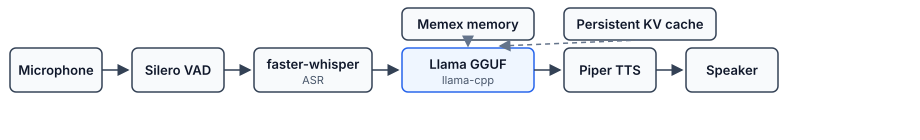

# ImpactEdgeVoice

**Fully local, sub-700 ms voice assistant — mic to speaker, zero network.**

ImpactEdgeVoice is an inference-systems project built around five technical constraints that make local voice AI interesting: persistent KV cache, interrupt-safe barge-in, speculative prefill, long-term memory (Memex), and adaptive model routing. Everything runs on a single consumer laptop; no audio or text ever leaves the device.

---

## System Requirements

| Component | Minimum | Recommended |
|-----------|---------|-------------|
| RAM | 8 GB | 16 GB |
| Storage | 4 GB free | 10 GB (both model tiers) |
| OS | Windows 10 / macOS 12 / Ubuntu 22 | — |
| Python | 3.10+ | 3.11 |
| GPU | Optional | Metal (Apple Silicon) or CUDA |

---

## Quickstart

```bash
# 1. Clone
git clone https://github.com/msunda17/impactedgevoice-cli.git
cd impactedgevoice-cli

# 2. Create virtualenv
python -m venv venv
source venv/bin/activate        # Windows: venv\Scripts\activate

# 3. Install
pip install -e ".[memex]"

# 4. Download models (downloads Llama 3.2 1B + 3B via huggingface-cli)
python download_models.py

# 5. Run
python -m impactedgevoice
```

> **GPU acceleration**: install `llama-cpp-python` with your backend before step 3.
> ```bash
> # Apple Silicon (Metal)
> CMAKE_ARGS="-DGGML_METAL=ON" pip install llama-cpp-python
>
> # NVIDIA CUDA
> CMAKE_ARGS="-DGGML_CUDA=ON" pip install llama-cpp-python
>
> # Vulkan (AMD / Intel discrete)
> CMAKE_ARGS="-DGGML_VULKAN=ON" pip install llama-cpp-python
> ```

---

## Models

Models live in `models/` (gitignored). Run `python download_models.py` to fetch them automatically, or place GGUF files manually.

| Tier | File | Size | Used for |
|------|------|------|----------|
| Simple | `Llama-3.2-1B-Instruct-Q4_K_M.gguf` | ~0.8 GB | Voice Q&A, chitchat |
| Complex | `Llama-3.2-3B-Instruct-Q4_K_M.gguf` | ~2.0 GB | Documents, reasoning |
| TTS | `models/piper/en_US-lessac-medium.onnx` | ~65 MB | Speech synthesis |

The router auto-discovers any matching GGUF in `models/` — see `impactedgevoice/model_router.py` for the full candidate list.

---

## Modes

```
python -m impactedgevoice
```

The interactive menu offers four modes:

- **Voice** — continuous mic, VAD-triggered turns, barge-in supported
- **File** — summarize a PDF or text file, then voice Q&A over it
- **Text** — typed input, voice output (no mic required)
- **Benchmark** — latency profiling (p50/p95/p99 across prefill, TTFT, decode, TTS)

---

## Architecture: The Five Crown Jewels

At runtime, audio flows through a streaming pipeline while Memex and the KV cache feed the LLM in parallel:



### 1. Persistent KV Cache (`kv_cache.py`)
The system prompt is tokenised and prefilled **once** at startup. Every subsequent turn appends tokens to the live KV cache rather than re-encoding the full history. Named checkpoints (`system`, `primed`, `pre_assistant`) allow O(1) rollback via `llama_kv_cache_seq_rm()`.

### 2. Barge-In + Conversational State Machine (`bargein.py`)
A five-state FSM (`IDLE → USER_SPEAKING → THINKING → SPEAKING → INTERRUPTED`) coordinates three atomic cleanup steps on interrupt: signal the decode thread via `threading.Event` (cooperative cancellation), flush the audio ring buffer with `sd.stop()`, and truncate the KV cache to the pre-assistant checkpoint.

### 3. Speculative Prefill (`speculative_prefill.py`)
LLM prefill starts **before** the user finishes speaking. Stable ASR partials (unchanged for ≥2 consecutive 400 ms windows, ≥3 words) trigger a background thread that prefills user tokens speculatively. On VAD-end, the final transcript either confirms the work or rolls back via checkpoint. Typical TTFT reduction: **150–200 ms**.

### 4. Memex — Persistent + Live Memory (`memex/`)
A local-first, queryable memory layer backed by SQLite WAL + numpy memmap.

- **Cross-session recall**: BM25 + embedding (MiniLM-L6-v2, 384-dim) + recency + importance hybrid retrieval. Recalled memories are injected as a `[MEMEX]` block prepended to the user turn.
- **Live in-session pruning**: When KV occupancy hits 80%, `LivePruner` compacts the oldest turns into a summary, stores it in Memex, and truncates the KV cache back to the baseline checkpoint — enabling indefinite-length conversations.
- **Speculative recall**: Memex lookup fires in a daemon thread on the first stable ASR partial so the context block is ready by VAD-end.
- **Cross-session memory linking**: `MemoryLinker` connects related memories across sessions via topic Jaccard + embedding cosine similarity, building a `parent_id` thread graph in SQLite.
- **Dedicated summarizer**: A separate `llama_cpp.Llama` instance (1B Q4, isolated from the conversation KV) handles all memory compaction. Falls back to extractive summarization if no model file is found.

### 5. Adaptive Model Routing (`model_router.py`)
Keyword + length heuristics route queries to the 1B model (simple voice Q&A) or the 3B model (document summarization, complex reasoning). Models are lazy-loaded — voice-only users never pay the 3B memory cost.

---

## Benchmarking

```bash
# Core latency benchmark (prefill / TTFT / decode / TTS)
python bench/bench.py

# Memex subsystem (store/recall latency, recall@k quality)
python bench/bench_memex.py

# Context-awareness (accuracy uplift with Memex vs. baseline)
python bench/bench_context.py
```

Results are written to `bench/latency.jsonl` (gitignored). See `bench/gemini_comparison.md` for the comparative benchmarking strategy against Gemini Live.

---

## Project Structure

```
impactedgevoice/
├── orchestrator.py         # Main event loop — coordinates all components
├── kv_cache.py             # Crown Jewel #1: persistent KV + checkpoint/restore
├── bargein.py              # Crown Jewel #2: state machine + interrupt
├── speculative_prefill.py  # Crown Jewel #3: ASR/LLM overlap
├── memex/                  # Crown Jewel #4: persistent + live memory
│   ├── manager.py          # Public API: store / recall / get_thread
│   ├── storage.py          # SQLite WAL + numpy memmap
│   ├── summarizer.py       # Dedicated LLM compaction + extractive fallback
│   ├── embedder.py         # MiniLM sentence embeddings (384-dim)
│   ├── retriever.py        # BM25 → embedding → recency → importance
│   ├── injector.py         # [MEMEX] context block builder
│   ├── linker.py           # Cross-session memory thread linking
│   └── pruner.py           # Live in-session KV pruning
├── model_router.py         # Crown Jewel #5: adaptive 1B/3B routing
├── asr.py                  # Batch ASR + StreamingASR (faster-whisper)
├── tts.py                  # Piper TTS wrapper
├── vad.py                  # Silero VAD wrapper
├── audio_io.py             # sounddevice + asyncio glue
├── bargein.py              # Barge-in controller + state machine
├── document_processor.py   # PDF/text summarization pipeline
├── console.py              # ANSI styling + muted log formatter
└── menu.py                 # Interactive CLI (voice / file / text)

bench/
├── bench.py                # Latency benchmark (p50/p95/p99)
├── bench_memex.py          # Memex store/recall/quality benchmark
├── bench_context.py        # Context-awareness accuracy benchmark
├── golden_recall.json      # Golden set for recall@k evaluation
├── conversation_chains.json# Multi-turn chains for context testing
└── gemini_comparison.md    # Cloud comparison strategy

download_models.py          # One-command model downloader
INTERNAL_ARCHITECTURE.md    # Detailed implementation reference
MEMEX_PLAN.md               # Memex design document (implemented)
```

---

## Development

```bash
# Install with test dependencies
pip install -e ".[memex,test]"

# Run tests
pytest tests/ -v

# Lint (optional)
pip install ruff && ruff check impactedgevoice/
```

---

## Privacy

All processing is local. No audio, transcripts, or memory data leave the device.

- `memex_data/` — local SQLite + embeddings, gitignored
- `models/` — GGUF weights, gitignored
- No telemetry, no network calls during inference

---

## License

MIT
